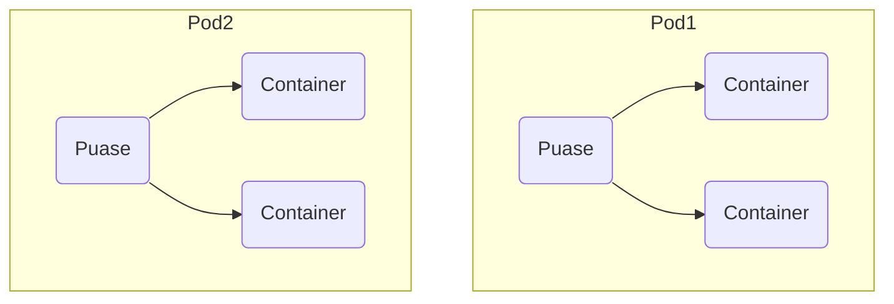

## 环境参数

## 了解Kubernetes 

Kubernetes - 舵手

Kubernetes是什么？

Kubernetes, also known as K8s, is an open-source system for automating deployment, scaling, and management of containerized applications.

It groups containers that make up an application into logical units for easy management and discovery. Kubernetes builds upon 15 years of experience of running production workloads at Google, combined with best-of-breed ideas and practices from the community.

### Kubernetes主要特征
#### 以服务为中心
#### 自动化

## 快速入门

### 核心概念

### 架构设计

### 认证授权

## 高可用集群搭建

## 业务系统迁移kubernetes - 准备工作 
### Harbor
### 服务发现
### IngressNginx 

## 业务系统迁移kubernetes - 最佳实践
### Docker化
### 跑在k8s集群中  
### 服务发现 

## CICD 

## 深入kubernetes - 几个重要的资源对象 

### namespace
### resources
### label 

## 深入kubernetes - 服务调度与编排 
### 健康检查
### 调度策略 
### 部署策略
### 深入pod 

## 深入kubernetes - 落地实践
### IngressNginx 
### PV/PVC/StorageClass
### StatefulSet 
### kubernetes API 

## 深入kubernetes - 日志与监控
### 日志主流方案
### 从日志采集到日志展示 
### Prometheus 

